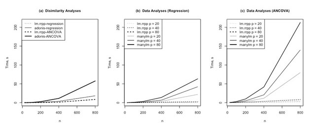

```{r setup, include=FALSE}
library(knitr)
knitr::opts_chunk$set(echo = TRUE)
```

# The RRPP Package

`RRPP` is a package for fitting linear models to high-dimensional (multivariate) data, or univariate data, and evaluating those models and related components using residual randomization permutation procedures (RRPP).  

The methods in `RRPP` are based on analytical advances in: Collyer and Adams (2013); Collyer, Sekora, and Adams (2015), Adams and Collyer (2016; 2018a, 2018b, 2019). Our work developed residual randomization for multivariate data analysis; extending univariate results from Anderson and colleagues (e.g., Anderson 2001; McArdle and Anderson, 2001; Anderson and terBraak 2003).  Our work also provides a permutation-based *effect size*, which is useful for evaluating the strength of signal in datasets. 

The`RRPP` package was announced in Methods in Ecology and Evolution (Collyer and Adams, 2018: MEE), and the CRAN install contains several vignette tutorials and extensive help files to assist the user. 

***Getting Started: An RRPP data frame***

Using `RRPP` it is often useful to create an RRPP data frame, and call components from this object. RRPP data frames are lists, and can include vectors, factors and various matrices (data matrices, covariance matrices, and distance matrices).  

```{r}
library(RRPP)
y <- matrix(rnorm(30), 10, 3)
x <- rnorm(10)
rdf <- rrpp.data.frame(x = x, y = y)
rdf # looks more like a list

d <- dist(y) # distance matrix as data
rdf <- rrpp.data.frame(rdf, d = d) # works

```

***Example 1: Univariate ANOVA and Mixed-Models***


```{r}
data("PupfishHeads")
str(PupfishHeads)
PupfishHeads$logHeadSize <- log(PupfishHeads$headSize)
fit <- lm.rrpp(logHeadSize ~ sex + locality/year, 
               SS.type = "I", data = PupfishHeads, 
               print.progress = FALSE, iter = 9999)
coef(fit)
summary(fit)
anova(fit, effect.type = "F")$table
```

NOTE the effect sizes (Z-scores) in the anova table.  These provide a sense of the strength of signal for that particular pattern (very useful for multivariate data).

```{r}
hist(fit$ANOVA$Fs[3,-1],prob=TRUE, xlab = "F-Empirical", main = NULL)
lines(density(fit$ANOVA$Fs[3,-1]), lwd=2, col="red")
```

And here we see that empirically-generated sampling distributions match those from theory

Note that the ANOVA summary is a default that fails to consider the year fish were sampled as a random effect.   A mixed-model ANOVA update can be performed by changing the expected mean-square (_MS_) error estimates in each _F_ calculation: 
    
```{r}
anova(fit)
anova(fit, effect.type = "F", 
  error = c("Residuals", "locality:year", "Residuals"))
```

It might be of interest to visualize model predictions for certain effects, holding constant other effects:

```{r, fig.height=3, fig.width=5}
sizeDF <- data.frame(sex = c("Female", "Male"))
rownames(sizeDF) <- c("Female", "Male")
sizePreds <- predict(fit, sizeDF)
plot(sizePreds, pch = 21, cex = 3, bg = c(2,4), lwd = 2)

```

Finally, the _SS_ type can be also toggled easily by refitting the model (I=sequential,II=conditional, III=marginal):

```{r}
fit2 <- lm.rrpp(logHeadSize ~ sex + locality/year, 
                SS.type = "II", data = PupfishHeads, print.progress = FALSE)
fit3 <- lm.rrpp(logHeadSize ~ sex + locality/year, 
                SS.type = "III", data = PupfishHeads, print.progress = FALSE)

anova(fit)$table
anova(fit2)$table
anova(fit3)$table

```
******
***Example 2: RRPP with High-Dimensional Data***

In the second example, we highlight the `RRPP` ability to efficiently handle high-dimensional data (_p_>>_n_) requiring large data computations.  For this demonstration, a 54(_n_) × 112 (_p_) matrix of shape data are used.  

Here we evaluate shape as a function of size and groups (a multivariate 'common slopes' model):

```{r}
data(Pupfish)
Pupfish$logSize <- log(Pupfish$CS) 
fit <- lm.rrpp(coords ~ logSize + Sex*Pop, SS.type = "I", 
               data = Pupfish, print.progress = FALSE) 
summary(fit, formula = FALSE)
anova(fit) 
coef(fit, test = TRUE) 

```
ANOVA results reveal that after accounting for body size allometry, not only are there significant inter-population differences in body shape and sexual dimorphism in body shape, but sexual dimorphism also significantly varies between the two populations.  

Now, to appreciate the flexibility of RRPP, compare this to the same analysis attempted via parametric methods: 

```{r, error = TRUE}
fit$LM$data$coords <- Pupfish$coords
fit.par <- lm(fit$call$f1, data = fit$LM$data)
identical(fit$LM$coefficients, fit.par$coefficients)
summary(manova(fit.par))
```

Although both functions return the same coefficients, the error summarizing the attempted parametric M-ANOVA clearly indicates the limitation of having residual degrees of freedom (rank) lower than the number of variables.   Returning to the `lm.rrpp` fit, which does not suffer this problem, as statistical evaluation is based on randomization, _as well as summary test measures that do not require the inversion of covariance matrices_ (see Anderson 2001; Collyer, Sekora, and Adams 2015).

We can examine the precision of group mean estimation, accounting for allometric shape variation, by doing the following:

```{r, fig.height=5, fig.width=6}
shapeDF <- expand.grid(Sex = levels(Pupfish$Sex), Pop = levels(Pupfish$Pop))
rownames(shapeDF) <- paste(shapeDF$Sex, shapeDF$Pop, sep = ".")
shapePreds <- predict(fit, shapeDF, confidence = 0.95)
plot(shapePreds, PC = TRUE, ellipse = TRUE, 
     pch = 19, col = 1:NROW(shapeDF)) # with added par arguments

groups <- interaction(Pupfish$Sex, Pupfish$Pop)
plot(fit, type = "PC", pch = 19, col = groups) # with added par arguments

```

Here, `RRPP` is providing an ordination of **predicted or fitted values** via principal components. These plots differ as there is a rotational difference between the covariance matrices estimated with 4 predicted and 54 fitted values.  Additionally, the former illustrates prediction precision and the latter sample dispersion.  Both functions allow passing `par` arguments to the plot as well as saving plot data for more advanced plotting.  The following is a regression-type plot:

```{r, fig.height=5, fig.width=6}
plot(fit, type = "regression", reg.type = "PredLine", 
    predictor = Pupfish$logSize, pch=19,
    col = as.numeric(groups))
```

Because the multivariate data above reside in a Euclidean (=metric) space, this analysis could be performed with an object of class `dist` (values from lower half of a distance matrix) representing the inter-specimen shape (Euclidean) distances, using the following code:

```{r}
D <- dist(Pupfish$coords) # inter-observation Euclidean distances
Pupfish$D <- D

fitD <- lm.rrpp(D ~ logSize + Sex*Pop, SS.type = "I", 
                data = Pupfish, print.progress = FALSE) 
anova(fitD)
anova(fit)
```
The ANOVA results with either method are exactly the same (see also `summary(fit)`).

******
***Comparison to Vegan***

The previous analysis has parallels to other R-functions, notably the `adonis` function in `vegan`. However, there are some important differences. A simple example illustrates these:

```{r}
fit.uni <- lm.rrpp(logSize ~ Sex*Pop, data=Pupfish, print.progress = FALSE)
anova(fit.uni)

library(vegan)
adonis(dist(Pupfish$logSize) ~ Pupfish$Sex*Pupfish$Pop)

```
Notice that the SS, MS, Rsq and F values are exactly the same, but the significance values differ. This is because `adonis` does not use residual randomization. If instead in `RRPP` one does: 

```{r}
fit.uni <- lm.rrpp(logSize ~ Sex*Pop, data=Pupfish,RRPP = FALSE, print.progress = FALSE)
anova(fit.uni)
```
Now the results are equivalent (but see Anderson and terBraak 2003; Collyer and Adams 2013 etc. for why RRPP is prefered). 

Finally, there are major speed differences between the packages
```{r}
  
```


******
***Example 3: Pairwise comparisons of groups, slopes, and dispersion***

The function, pairwise, can be used to test pairwise differences between least-squares means with:
```{r}
PWT <- pairwise(fit, groups = interaction(Pupfish$Sex, Pupfish$Pop))
summary(PWT, confidence = 0.95)

```
Much like the tukeyHSD function in the R stats package, `pairwise` will generate tables with confidence intervals and _P_-values for the pairwise statistic, Euclidean distance between least-squares means.  

This function can also be used to compare the within-group dispersion (=disparity) among groups: 

```{r}
summary(PWT, confidence = 0.95, test.type = "var")

```

Additionally, for regression models, this function can also be used for pairwise comparison of slopes in analysis of covariance (ANCOVA) designs.

```{r}
fit2 <- lm.rrpp(coords ~ logSize * Sex * Pop, SS.type = "I", 
                data = Pupfish, print.progress = FALSE, iter = 999) 
anova(fit, fit2, print.progress = FALSE)

PW2 <- pairwise(fit2, fit.null = fit, groups = groups, 
                covariate = Pupfish$logSize, print.progress = FALSE) 
PW2
summary(PW2, confidence = 0.95, 
        test.type = "dist") # distances between slope vector lengths
summary(PW2, confidence = 0.95, 
        test.type = "VC",
        angle.type = "deg") # correlation between slope vectors (and angles)

```


******
***Example 4: GLS Estimation***

Another advantage of `RRPP` is its ability to perform GLS estimation via residual randomization. For details on the underlying conceptual development see (Adams and Collyer, 2018a; 2018b; earlier work: Adams 2014; Adams and Collyer, 2015).  The following code creates two `lm.rrpp` fits using OLS and GLS, respectively, and evaluates them as in previous examples. Non-independence among objects (species) is due to phylogeny:

```{r}
data(PlethMorph)
library(ape)
tree <- read.tree('plethtree.tre')
plot(tree,show.tip.label = FALSE)

fitOLS <- lm.rrpp(TailLength ~ SVL, 
                  data = PlethMorph,
                  print.progress = FALSE)
fitGLS <- lm.rrpp(TailLength ~ SVL, 
                  data = PlethMorph, 
                  Cov = PlethMorph$PhyCov,
                  print.progress = FALSE)

anova(fitOLS)
anova(fitGLS)

coef(fitOLS, test = TRUE)
coef(fitGLS, test = TRUE)

```

Although analyses on either model fit indicate a significant relationship between tail length and snout-to-vent length (SVL), the GLS coefficients test and ANOVA show how phylogenetic auto-correlation among species augments the OLS-estimated relationship.  

Importantly, `RRPP` can be used with _ANY_ covariance matrix that describes the expected non-independence among objects. Thus, while phylogenetic non-independence was shown here, one could use an appropriate spatial or temporal covariance matrix to account for non-independence due to these other effects (NOTE: other weighted GLS analyses, such as for accounting for heteroscedasticity, can be modeled in this fashion also).

These methods also work for multivariate data (note how predictions display less variation when non-independence is accounted for using GLS):

```{r, fig.height=4, fig.width=8}
Y <- as.matrix(cbind(PlethMorph$TailLength,
PlethMorph$HeadLength,
PlethMorph$TailLength,
PlethMorph$Snout.eye,
PlethMorph$BodyWidth,
PlethMorph$Forelimb,
PlethMorph$Hindlimb))
PlethMorph <- rrpp.data.frame(PlethMorph, Y=Y)

fitOLSm <- lm.rrpp(Y ~ SVL, data = PlethMorph,
                   print.progress = FALSE)
fitGLSm <- lm.rrpp(Y ~ SVL, data = PlethMorph, 
                   Cov = PlethMorph$PhyCov,
                   print.progress = FALSE)

anova(fitOLSm)
anova(fitGLSm)

sizeDF <- data.frame(SVL = sort(PlethMorph$SVL))

```

***Analytical Summary***

On the surface, these examples and their analyses should seem intuitive to any user of R who has used the `lm` function plus its associated S3 generics (`coef, predict, resid, fitted, summary`, and `anova`), all of which can be used on `lm.rrpp` model fits.  The functions, `pairwise` (not an S3 generic) and `anova`, also allow pairwise comparisons of least-squares means or slopes and multi-model inferences, respectively. Advanced users will recognize, however, much more extensive useable results for adaptive programming.  The output from a `lm.rrpp` fit is arranged hierarchically, i.e.:

```{r}
attributes(fit)

```

Within the `$LM` partition, all attributes of the lm function are found, in addition to coefficients for every random permutation.  Within the `$ANOVA` partition, the SS type, plus `SS`, `MS`, `R`^2^, `F`, and Cohen's `f`^2^ for all permutations, as well as effect sizes estimated for each of these are provided.  Within the `$PermInfo` partition, the number of permutations, type (RRPP or randomization of "full" data values, FRPP), and sampling frame in every permutation (schedule) are provided.  Thus, lm.rrpp is the workhorse that makes all downstream analysis efficient.


