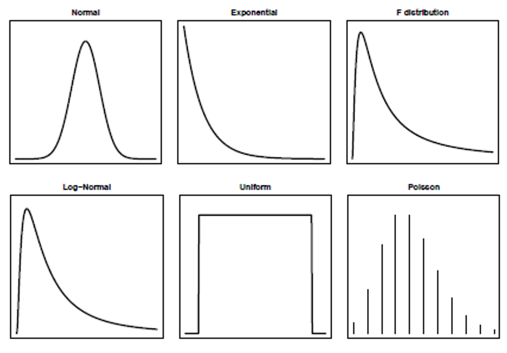
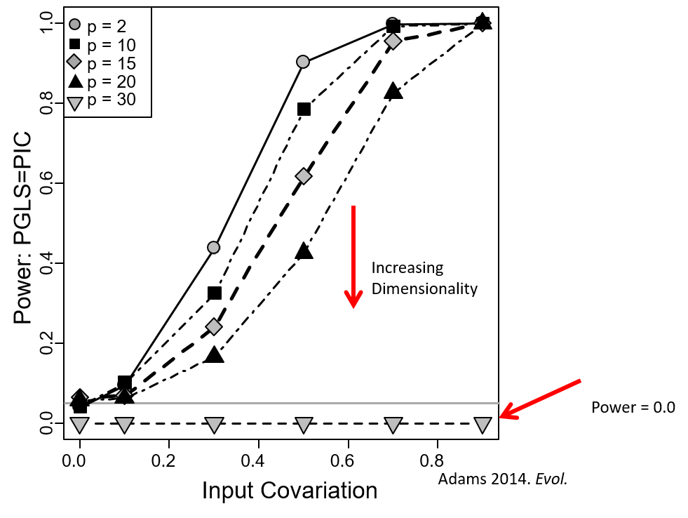
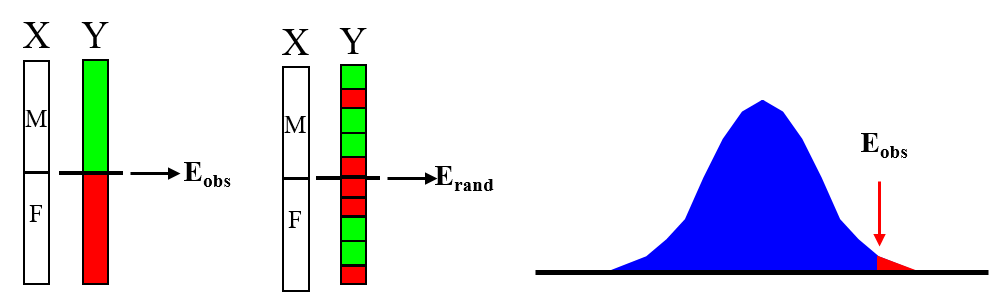
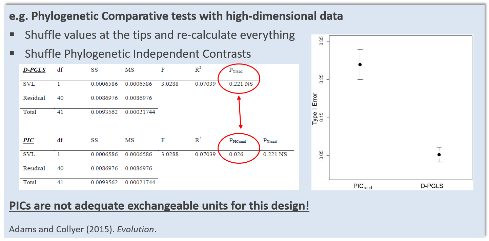
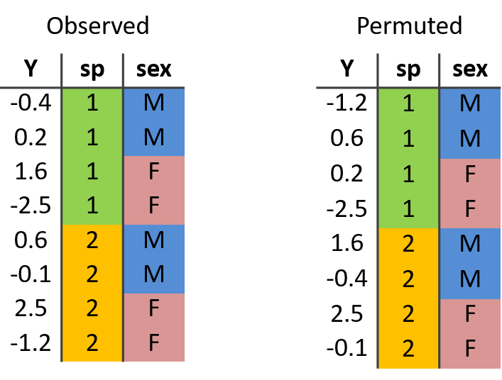
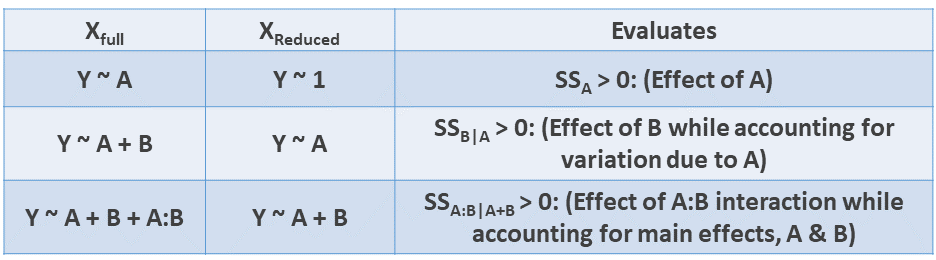
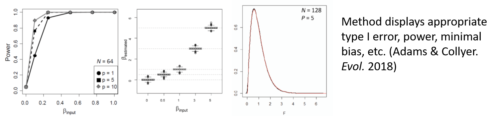

```{r setup, include=FALSE, echo = TRUE, tidy = TRUE}
library(knitr)
library(RRPP)
opts_chunk$set(echo = TRUE)
```

# Parametric Statistics and Expected Distributions

Parametric statistical approaches are often used to test hypotheses and make inferences

Numerous distributions of expected values have been generated from theory for different types of data and hypotheses

```{r, echo = FALSE,out.width="70%"}
  
```

Each have assumptions about the behavior of the underlying data (or their residuals)


# Challenges to Parametric Theory

Biological data display numerous challenges for parametric theory

1: Data/residuals may not meet assumptions
    
2: Hypothesis may not correspond to an existing theoretical distribution

3: Data can be highly-dimensional, causing $\small{N:P}$ issues

```{r, echo = FALSE, out.width="30%"}

```

Power $\small\downarrow$ as dimensionality $\small\uparrow$, and eventually computations cannot be completed (the 'curse' of dimensionality)

**Alternative mechanisms for evaluating hypotheses are required**

# Randomization/Permutation Methods

Utilize *empirically-generated sampling distributions*, not those derived from theory, to evaluate test statistics

Are flexible: can assess patterns in high-dimensional data, as well as complex or non-standard designs

# Randomization/Permutation Methods

Utilize *empirically-generated sampling distributions*, not those derived from theory, to evaluate test statistics

Are flexible: can assess patterns in high-dimensional data, as well as complex or non-standard designs

**Procedure**

  - 1: Obtain summary measure from the observed data ($E_{obs}$)

  - 2: Permute data, obtain random measure ($E_{rand}$)

  - 3: Repeat many times to obtain distribution of possible outcomes ($E_{rand}$)

  - 4: Significance: $\small\Pr(E_{obs}) = \frac{N_{E_{rand} \geq E_{obs}}}{N_{perm}+1}$ 

NOTE: $\small{N}_{E_{rand} \geq E_{obs}}$ includes $E_{obs}$ in count, as observed data is one possible permutation

# Randomization/Permutation Methods

Utilize *empirically-generated sampling distributions*, not those derived from theory, to evaluate test statistics

Are flexible: can assess patterns in high-dimensional data, as well as complex or non-standard designs

**Procedure**

  - 1: Obtain summary measure from the observed data ($E_{obs}$)

  - 2: Permute data, obtain random measure ($E_{rand}$)

  - 3: Repeat many times to obtain distribution of possible outcomes ($E_{rand}$)

  - 4: Significance: $\small\Pr(E_{obs}) = \frac{N_{E_{rand} \geq E_{obs}}}{N_{perm}+1}$ 

NOTE: $\small{N}_{E_{rand} \geq E_{obs}}$ includes $E_{obs}$ in count, as observed data is one possible permutation

```{r, echo = FALSE,out.width="70%"}
  
```


# Randomization: Example

Are male sparrows larger than female sparrows (**Data from Bumpus 1898**)?

```{r echo = FALSE, eval=TRUE,out.width="30%"}
bumpus<-read.csv("lectureData/02.Resampling/bumpus.csv",header=T)
sex<-as.factor(bumpus$sex)
TL<-bumpus$TL
TotLen<-split(TL,sex)
hist(TotLen$m, col=rgb(0,0,1,0.5),freq=TRUE,main=NULL)
hist(TotLen$f, col=rgb(1,0,0,0.5), add=T)
```

# Randomization: Example

Are male sparrows larger than female sparrows (**Data from Bumpus 1898**)?

```{r echo = FALSE, eval=TRUE,out.width="30%"}
bumpus<-read.csv("lectureData/02.Resampling/bumpus.csv",header=T)
sex<-as.factor(bumpus$sex)
TL<-bumpus$TL
TotLen<-split(TL,sex)
hist(TotLen$m, col=rgb(0,0,1,0.5),freq=TRUE,main=NULL)
hist(TotLen$f, col=rgb(1,0,0,0.5), add=T)
```

Use difference value as test value: $E_{obs}=\left(\mu_{M}-\mu_{F}\right)$ & 999 permutations

```{r echo = FALSE, eval=TRUE,out.width="30%"}
E.obs<-diff(tapply(TL,sex,mean))
permute<-999
E.rand<-array(NA,permute+1)
E.rand[1]<-E.obs
for(i in 2:(permute+1)){
	TL.r<-sample(TL)
	E.rand[i]<-diff(tapply(TL.r,sex,mean))
}
p.val<-RRPP:::pval(E.rand)
hist(E.rand,main="Empirical distribution of (M-F) from permutation")
segments(E.obs, 0, E.obs, 50)  
```

Observed difference and significance level:
```{r echo = FALSE, eval = TRUE,out.width="30%"}
E.obs
p.val
```


# Permutation: Designing The Test

Devising a proper permutation test requires several components:

1: Identifying the null hypothesis $\small{H}_{0}$

2: Determining whether there is a known expected value under $\small{H}_{0}$

3: Identifying which values may be permuted and how to estimate expected distribution under $\small{H}_{0}$

###### see: Commanges. (2003). Good. (2004).; Sekora, Adams & Collyer. Heredity (2015). Adams & Collyer. Evol. (2018)

Essentially, one must determine:

1: What to permute? 

2: How to permute it? 


# The Logic of Permutation Tests

Permutation tests generate empirical sampling distributions under $\small{H}_{0}$

How do we accomplish this? 

A simple logic flow:

1: Define $\small{H}_{0}$ and $\small{H}_{1}$

2: Identify what *differs* between $\small{H}_{0}$ and $\small{H}_{1}$ (i.e., what does $\small{H}_{1}$ quantify relative to $\small{H}_{0}$?)

3: Permute the data which 'breaks up' the signal in $\small{H}_{1}$ relative to $\small{H}_{0}$


# The Logic of Permutation Tests: Example

Are males and females different in size? 

- $\small{H}_{0}$: no difference: $\small{T}_{obs}=0$ or more directly $\small\left(\mu_{M}-\mu_{F}\right)=0$

- $\small{H}_{1}$: differences between males and females: $\small{T}_{obs}\neq0$ or more directly $\small\left(\mu_{M}-\mu_{F}\right)\neq0$

Approach: Calculate $\small{E}_{obs}=\small\left(\mu_{M}-\mu_{F}\right)$

Permute size values (leave M/F column unchanged)

Estimate $\small{E}_{rand}=\small\left(\mu_{M}-\mu_{F}\right)$ from permuted data

```{r echo = FALSE, eval=TRUE,out.width="50%"}
hist(E.rand,main="Empirical distribution of (M-F) from permutation")
```

###### In this case, permuting the size data appears reasonable as a set of *exchangeable units* 


# Exchangeable Units

More formally, we seek to identify the correct *exchangeable units* under $\small{H}_{0}$

Exchangeable units are those values such that the permuted distribution is the same as that of the original

For linear models, we seek to retain two properties: 

1^st^ moment exchangeability: the expected value remains constant

2^nd^ moment exchangeability: the variance remains constant

**Permuting residuals** provides the general solution for linear models (retains both properties for OLS models, and the second for GLS: Adams and Collyer 2018, 2019)

###### see: Commanges. (2003). Good. (2004).; Sekora, Adams & Collyer. Heredity (2015). Adams & Collyer. Evol. (2018)

# Effect Sizes from Empirical Null Sampling  Distributions

- This philosophy allows estimation of effect sizes to provide an estimate of the *'strength of signal'* of the patterns in data

- It is often useful to obtain an effect size from empirical sampling distributions 

# Effect Sizes from Empirical Null Sampling  Distributions

- This philosophy allows estimation of effect sizes to provide an estimate of the *'strength of signal'* of the patterns in data

- It is often useful to obtain an effect size from empirical sampling distributions 

1. Perform RRPP many times.  
2. Calculate $F$-value in every random permutation (observed case counts as one permutation)
3. For $N$ permutations, $P = \frac{N(F_{random} \geq F_{obs})}{N}$
4. Calculate *effect size* as a standard deviate of the observed value in a normalized distribution of random values (helps for comparing effects within and between models); i.e.,
$$z = \frac{
\log\left( F\right) - \mu_{\log\left(F\right)}
} {
 \sigma_{\log\left(F\right)}
}$$
where $\mu_{\log\left(F\right)}$ and $\sigma_{\log\left(F\right)}$ are the expected value and standard deviation from the sampling distribution, respectively.

# Effect Sizes from Empirical Null Sampling  Distributions

- This philosophy allows estimation of effect sizes to provide an estimate of the *'strength of signal'* of the patterns in data

- It is often useful to obtain an effect size from empirical sampling distributions 

1. Perform RRPP many times.  
2. Calculate $F$-value in every random permutation (observed case counts as one permutation)
3. For $N$ permutations, $P = \frac{N(F_{random} \geq F_{obs})}{N}$
4. Calculate *effect size* as a standard deviate of the observed value in a normalized distribution of random values (helps for comparing effects within and between models); i.e.,
$$z = \frac{
\log\left( F\right) - \mu_{\log\left(F\right)}
} {
 \sigma_{\log\left(F\right)}
}$$
where $\mu_{\log\left(F\right)}$ and $\sigma_{\log\left(F\right)}$ are the expected value and standard deviation from the sampling distribution, respectively.

- $z$ is incredibly useful for comparisons of patterns across datasets or alternative hypotheses

###### NOTE: these z-scores are FULLY MULTIVARIATE, as the empirical $F$ may be obtained from multivariate data (see Collyer et al. *Heredity.* (2015); Adams & Collyer. *Evolution.* (2016); Adams and Collyer *Evolution.* (2019))

# Consequences of Incorrect Permutation

Incorrectly assigning exchangeable units can result in incorrect inferences

```{r, echo = FALSE, out.width="75%"}

```

Here, permuting phylogenetically independent contrasts is incorrect, because these values contain information from both the response ($\small\mathbf{Y}$) data as well as the phylogeny among taxa

# Permutation Procedures: Factorial Models

Often, one has more complex models with **Multiple** explanatory factors

Factorial model: $\small\mathbf{Y}=\mathbf{X_{A}}\mathbf{\beta_{A}} +\mathbf{X_{B}}\mathbf{\beta_{B}} +\mathbf{X_{AB}}\mathbf{\beta_{AB}}+\mathbf{E}$

Permuting $\small\mathbf{Y}$ is possible, but seems inadequate

```{r, echo = FALSE,out.width="40%"}
  
```

1: Does $\small\mathbf{Y}_{perm}$ retain 1^st^ and 2^nd^ moment exchangeability?

2: Does $\small\mathbf{Y}_{perm}$ properly separate $\small{SS_{A}}$ with $\small{SS_{B}}$ with $\small{SS_{AB}}$?

Answers: Yes (# 1 for 1^st^ moment [OLS] and no for 2^nd^) and No (# 2)


# Factorial Models and Residual Randomization

Factorial models $\small\mathbf{Y}=\mathbf{X_{A}}\mathbf{\beta_{A}} +\mathbf{X_{B}}\mathbf{\beta_{B}} +\mathbf{X_{AB}}\mathbf{\beta_{AB}}+\mathbf{E}$ are a set of sequential hypotheses comparing full ($\small\mathbf{X}_{F}$) and reduced ($\small\mathbf{X}_{R}$) models 

Testing each $\small\mathbf{X}_{F}$ requires appropriate permutation procedure for each $\small\mathbf{X}_{R}$

**Residual randomization** provides proper exchangeable units under each $\small\mathbf{X}_{R}$ 

# Factorial Models and Residual Randomization

Factorial models $\small\mathbf{Y}=\mathbf{X_{A}}\mathbf{\beta_{A}} +\mathbf{X_{B}}\mathbf{\beta_{B}} +\mathbf{X_{AB}}\mathbf{\beta_{AB}}+\mathbf{E}$ are a set of sequential hypotheses comparing full ($\small\mathbf{X}_{F}$) and reduced ($\small\mathbf{X}_{R}$) models 

Testing each $\small\mathbf{X}_{F}$ requires appropriate permutation procedure for each $\small\mathbf{X}_{R}$

**Residual randomization** provides proper exchangeable units under each $\small\mathbf{X}_{R}$ 

Must specify full and reduced models (Type I SS used in example)

```{r, echo = FALSE,out.width="70%"}
 
```

Mathematical justification:  

1: For any $\small\mathbf{X}_{R}$: $\small{SS}_{\mathbf{X}_{F}}=0$ 

2: Under $\small\mathbf{X}_{R}$, $\mathbf{E}_{R}$ represent those components of SS *NOT* explained by $\small\mathbf{X}_{R}$ (includes $\small{RSS}$ of $\small\mathbf{X}_{F}$ plus SS from term(s) not in $\small\mathbf{X}_{R}$)

3: Thus, permuting $E_{R}$ precisely embodies $\small{H}_{R}$ of: $\small{SS}_{\mathbf{X}_{F}}=0$ 

###### Univariate: Anderson. Can. J. Fish. Aquat. Sci. (2001); Anderson and terBraak. J. Stat. Comp. Simul. (2003)

###### Multivariate: Collyer & Adams. Ecol. (2007); Collyer, Sekora & Adams. Heredity. (2015); Adams & Collyer. Evol. (2018); Adams and Collyer. Evol. (2019)

# RRPP Properties

RRPP displays appropriate type I error, high power, correct parameter estimates, **and empirically-generated sampling distributions match those from parametric theory!**

```{r, echo = FALSE,out.width="70%"}
 
```

RRPP emulates what one expects from parametric approaches, but utilizes permutation methods to do so

Can be used for multivariate and high-dimensional data, even when $p>>N$ (here, parametric/likelihood methods cannot be used)


# Implementing RRPP

We have published an `R` package (`RRPP`) to perform residual randomization

`RRPP` may be used on OLS and GLS models

